# MVAIR Architecture Atlas

*Layer-by-layer maps of the AI voice-receptionist product. Prepared 25 June 2026.*
*Format: Mermaid (text-based diagrams). Each section below is an individual map. The source is editable — you can tweak any node or edge directly. Styling is deliberately minimal; the priority is clarity, not decoration.*

**Research backing:** the layer content comes from the three-part research engagement (`01`–`03`). The runtime mechanics, event names, response budgets, and payload contents were re-verified for this task against Vapi's current documentation (Server events, List Assistants / ServerMessage schema, Custom Tools, Assistant hooks, End-of-Call Report).

---

## How to read these maps — legend

**Status tags** (in every node label): `[RENTED]` runs inside Vapi · `[CUSTOM]` your code · `[LIVE]` built and working today · `[GAP]` not built, blocks a sale · `[FUTURE]` planned, not blocking.

**Node shapes**
- `(["stadium"])` — a running service / process
- `["rectangle"]` — a code module / component
- `[("cylinder")]` — a datastore
- `{{"hexagon"}}` — an external system or trust boundary endpoint
- `[/"parallelogram"/]` — an event / message on the wire

**Edge meaning**
- solid `-->` — live runtime data or control flow
- dashed `-.->` — not-yet-built, planned, or cross-cutting/observing relationship
- an edge label in quotes names the payload or trigger that crosses it

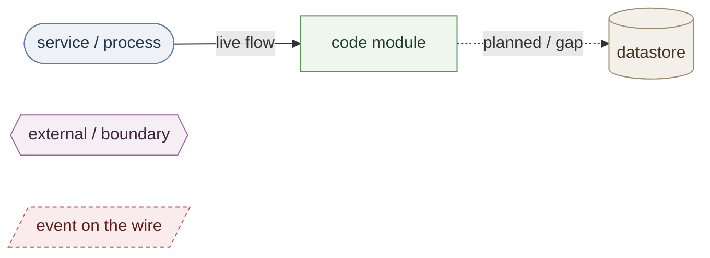

---

## Map 0 — Full-stack skeleton (the eight layers, edge to organs)

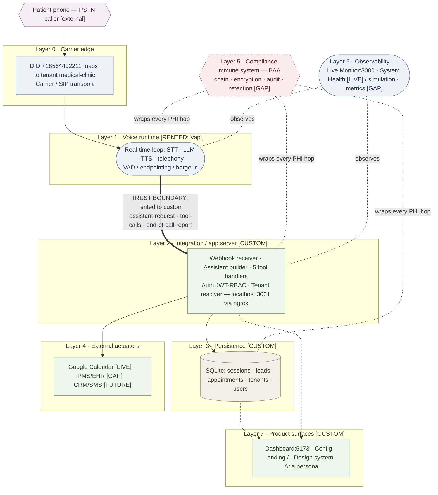

*The one structural fact to hold: the heavy edge between Layer 1 and Layer 2 is the only seam between what you rent and what you own. Everything below that line is your product; everything above it is commodity.*

---

## Map 1 — Layer 0 · Carrier edge

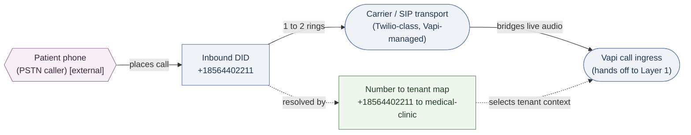

*Endpoints: one inbound number, one tenant today. Multi-tenant capable — additional numbers map to additional tenants without touching the engine.*

---

## Map 2 — Layer 1 · Voice runtime (the real-time loop, inside Vapi)

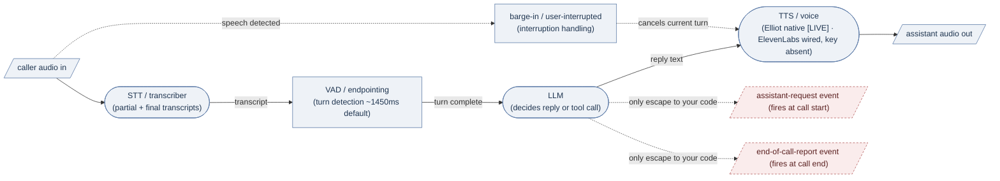

*Critical: this entire loop runs inside Vapi. There is no per-turn hook into your code. Your only two synchronous touch-points with a live call are the start event and the end event (next map).*

---

## Map 3 — Layer 1b · The Vapi server-event surface (every message that reaches your webhook)

```mermaid
flowchart TB
  vapi(["Vapi runtime"])

  subgraph LC["Lifecycle — needs a response"]
    e1[/"assistant-request — return assistant, transient, or transfer within 7.5s"/]
    e2[/"tool-calls — return result keyed by toolCallId"/]
    e3[/"transfer-destination-request"/]
    e4[/"handoff-destination-request"/]
  end
  subgraph LN["Conversation — notify only"]
    n1[/"conversation-update"/]
    n2[/"transcript (partial or final)"/]
    n3[/"speech-update"/]
    n4[/"model-output"/]
    n5[/"user-interrupted"/]
    n6[/"assistant.speechStarted (opt-in)"/]
  end
  subgraph LS["Status / close — notify only"]
    s1[/"status-update"/]
    s2[/"hang (no reply timeout)"/]
    s3[/"assistant.started"/]
    s4[/"end-of-call-report: transcript · recording URLs · analysis · costs"/]
  end

  vapi --> e1
  vapi --> e2
  vapi --> e3
  vapi --> e4
  vapi --> n1
  vapi --> n2
  vapi --> n3
  vapi --> n4
  vapi --> n5
  vapi --> n6
  vapi --> s1
  vapi --> s2
  vapi --> s3
  vapi --> s4

  classDef rented fill:#eef2f7,stroke:#5b7aa6,color:#1f3550;
  classDef act fill:#fff4e6,stroke:#c98a3a,color:#5a3a12;
  classDef note fill:#f4f4f4,stroke:#999,color:#333;
  class vapi rented;
  class e1 act; class e2 act; class e3 act; class e4 act;
  class n1 note; class n2 note; class n3 note; class n4 note; class n5 note; class n6 note;
  class s1 note; class s2 note; class s3 note; class s4 note;
```

*Orange = events that require a meaningful synchronous reply (these are where your server must be fast and correct). Grey = fire-and-forget notifications you persist or display. MVAIR uses `assistant-request`, `tool-calls`, and `end-of-call-report` as its load-bearing three.*

---

## Map 4 — Layer 2 · Integration / app server (your custom layer)

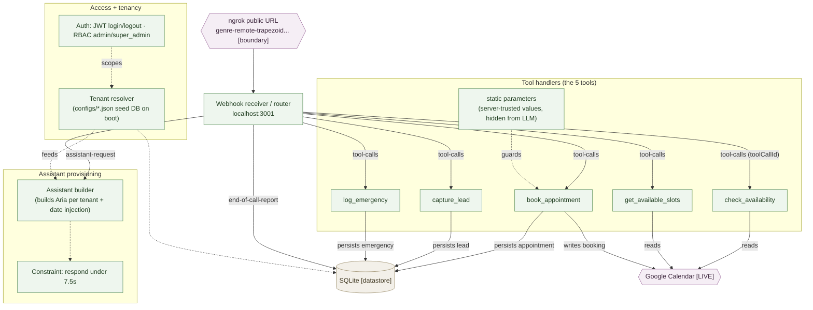

*Every edge into `db` and `gcal` is a place PHI may travel — cross-reference Map 7.*

---

## Map 5 — Layer 3 · Persistence (data model)

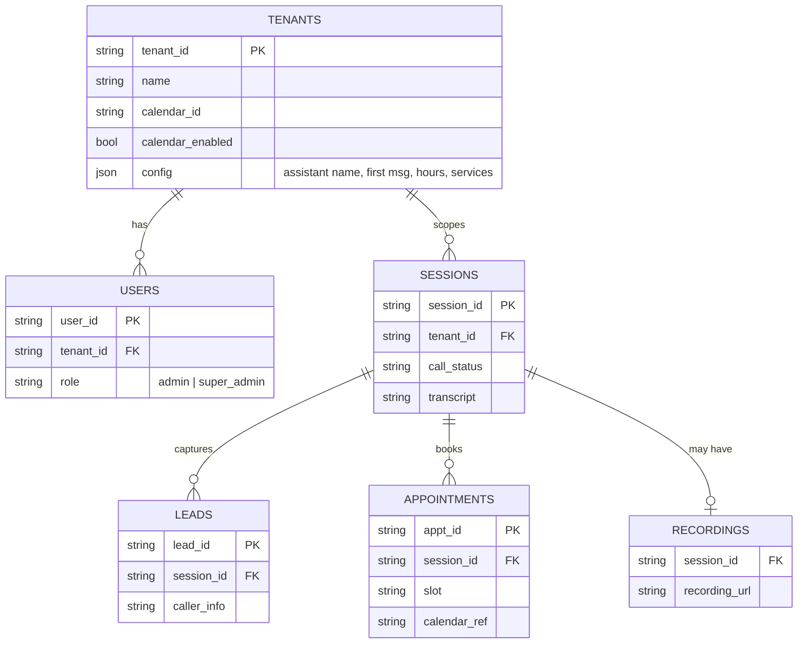

*Attributes shown are representative of the described build; confirm exact column names against the live schema. The shape matters more than the names: this model is strikingly **niche-agnostic** — `sessions / leads / appointments / tenants / users` carry no dental- or medical-specific assumptions, which is why a second niche reuses it unchanged.*

---

## Map 6 — Layer 4 · External actuators (the hands' reach)

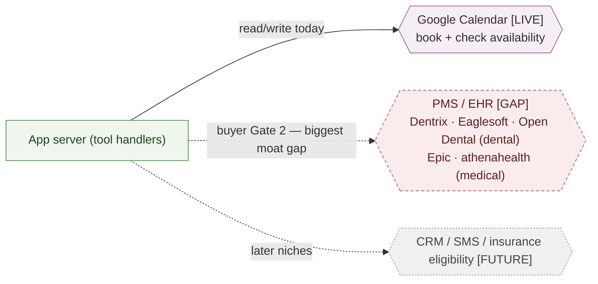

*This single map is the difference between a demo and a sellable medical product. Calendar = "takes a message / side calendar" tier; PMS write-back = the tier funded competitors occupy.*

---

## Map 7 — Layer 5 · Compliance immune system (BAA chain + PHI flow)

```mermaid
flowchart TB
  clinic{{"Clinic (covered entity)"}}
  mvair["MVAIR (business associate)"]
  vapi{{"Vapi (subprocessor)"}}
  stt{{"STT provider"}}
  llm{{"LLM provider"}}
  tts{{"TTS provider"}}
  tel{{"Telephony provider"}}
  store[("PHI at rest: SQLite + recordings")]

  clinic -.->|"BAA 1 [GAP]"| mvair
  mvair -.->|"BAA 2 [GAP]"| vapi
  vapi -.->|"flow-down BAA [GAP]"| stt
  vapi -.->|"flow-down BAA [GAP]"| llm
  vapi -.->|"flow-down BAA [GAP]"| tts
  vapi -.->|"flow-down BAA [GAP]"| tel

  clinic ==>|"PHI: voice"| vapi
  vapi ==>|"PHI: transcript / audio"| stt
  vapi ==>|"PHI: text"| llm
  vapi ==>|"PHI: text"| tts
  vapi ==>|"PHI: transcript + recording URLs"| mvair
  mvair ==>|"PHI: stored"| store

  enc["Controls required:<br/>TLS 1.3 in transit · AES-256 at rest [PARTIAL]<br/>RBAC + tamper-proof audit log [GAP]<br/>data minimisation + retention policy [GAP]"]
  enc -. "must hold across every solid PHI edge" .- vapi
  enc -. .- store

  classDef custom fill:#eef6ee,stroke:#5a8f5a,color:#234023;
  classDef ext fill:#f5eef5,stroke:#996699,color:#3d273d;
  classDef store fill:#f3f0e9,stroke:#9a8c6a,color:#403821;
  classDef gap fill:#faecec,stroke:#b35a5a,stroke-dasharray:4 3,color:#5a2020;
  class clinic ext; class vapi ext; class stt ext; class llm ext; class tts ext; class tel ext; class mvair custom; class store store; class enc gap;
```

*Dashed edges = the BAA chain (the legal flow-down). Thick edges = the actual PHI data path. A sale is legally possible only when every dashed edge on a thick PHI path is signed. This is Gate 1 drawn as a system, not a checkbox.*

---

## Map 8 — Layer 6 · Observability / evaluation

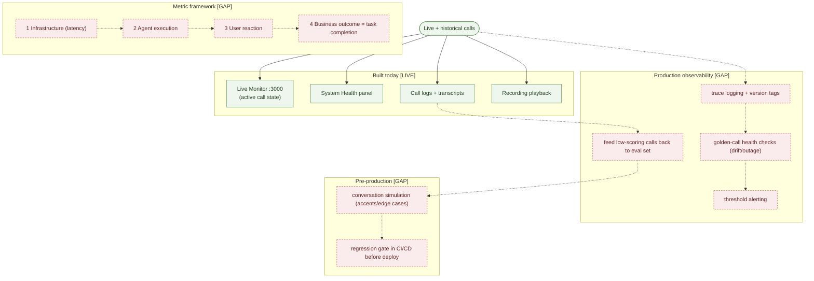

---

## Map 9 — Layer 7 · Product surfaces (flesh and skin)

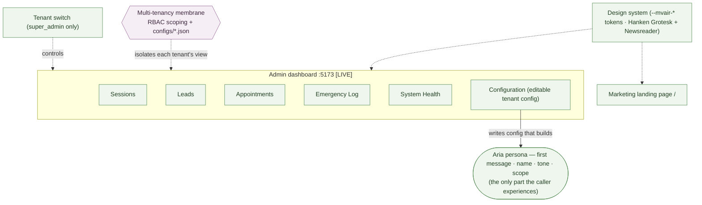

---

## Map 10 — Habitat (runtime topology — where each organ physically lives)

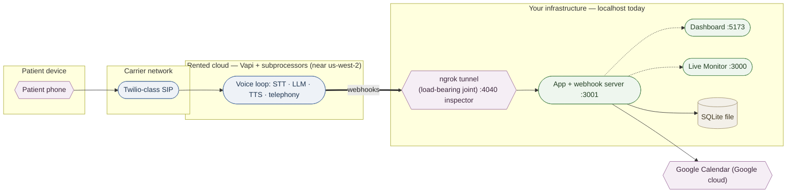

*The single point of failure for personalised calls: if the tunnel or `:3001` is down, `assistant-request` fails inside 7.5s and the call cannot be built. This is the mechanical meaning of "still on ngrok / no production deploy."*

---

## Pipeline P1 — Call provisioning (start of every call)

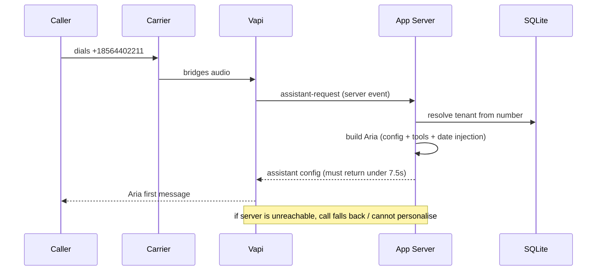

---

## Pipeline P2 — Real-time conversation loop (per turn, inside Vapi)

```mermaid
sequenceDiagram
  participant C as Caller
  participant STT as STT
  participant LLM as LLM
  participant TTS as TTS
  C->>STT: speaks (audio)
  STT->>LLM: transcript + replayed state
  LLM->>TTS: reply text
  TTS->>C: speech
  Note over C,TTS: state is replayed each turn — the model is stateless; no hook into your code here
```

---

## Pipeline P3 — Tool execution (the only in-call moment your code runs)

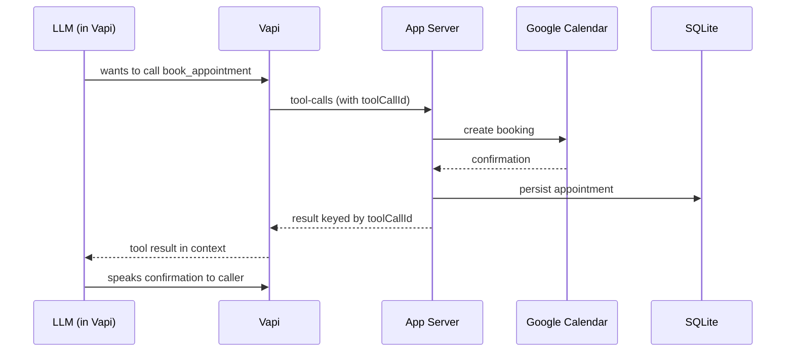

---

## Pipeline P4 — Post-call ingestion (end of every call)

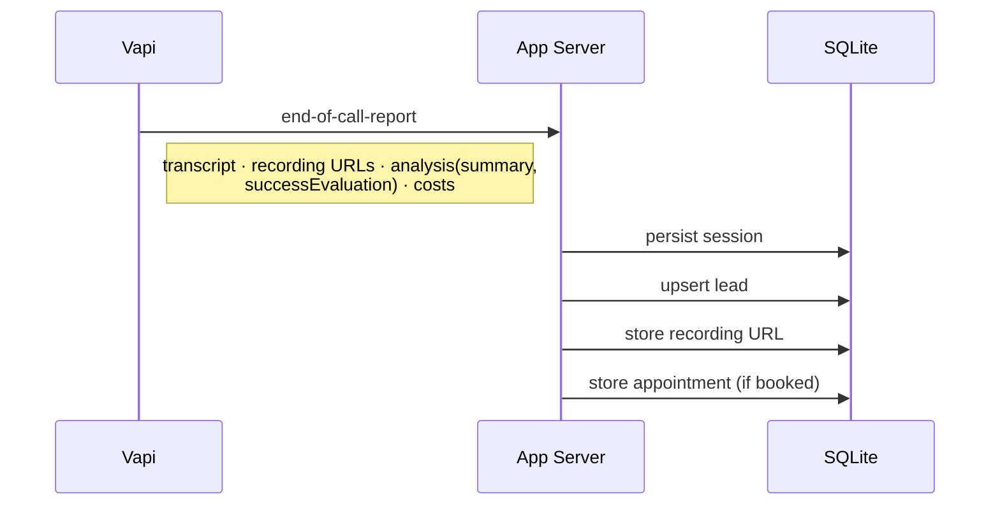

---

## Pipeline P5 — Compliance data-flow (the path that must be mapped to prove Gate 1)

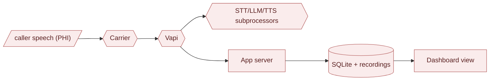

*Every box is a BAA-chain node and a retention/audit obligation. This is the explicit PHI map to hand to counsel.*

---

## Map 11 — Coupling map (seams vs welded joints)

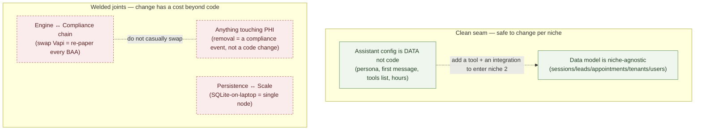

*This is the map to consult before any "plug-and-change" work: green seams are where modularity is cheap and safe; red joints are where it carries a compliance or scaling cost. Per Concern 3, extract modular boundaries from the green seams only, and only after a second concrete niche makes them necessary.*

---

### Index of maps

0. Full-stack skeleton — the eight layers
1. Layer 0 — Carrier edge
2. Layer 1 — Voice runtime loop
3. Layer 1b — Vapi server-event surface
4. Layer 2 — Integration / app server
5. Layer 3 — Persistence data model
6. Layer 4 — External actuators
7. Layer 5 — Compliance / BAA chain
8. Layer 6 — Observability
9. Layer 7 — Product surfaces
10. Habitat / runtime topology
11. Coupling map
- Pipelines P1–P5 (provisioning, conversation loop, tool execution, post-call ingestion, compliance data-flow)
